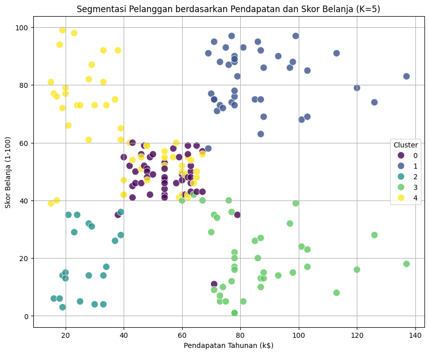

# Proyek Analisis Segmentasi Pelanggan (Mall Customer Segmentation)

<div align="center">
  
</div>

## Pendahuluan

Proyek ini merupakan bagian dari studi kasus analisis data untuk mengidentifikasi segmen-segmen pelanggan yang berbeda dalam dataset "Mall Customer". Dengan memahami karakteristik unik dari setiap segmen, bisnis dapat mengembangkan strategi pemasaran yang lebih tepat sasaran dan personal, meningkatkan kepuasan pelanggan, serta memaksimalkan keuntungan.

Dalam proyek ini, saya menerapkan berbagai teknik dasar hingga menengah dalam ilmu data, termasuk pemuatan data, eksplorasi data, normalisasi fitur, dan algoritma K-Means Clustering untuk segmentasi.

## Dataset

Dataset yang digunakan adalah `Mall Customer Dataset` yang berisi informasi dasar tentang pelanggan pusat perbelanjaan, termasuk:
- `CustomerID`: ID unik pelanggan
- `Gender`: Jenis kelamin pelanggan
- `Age`: Usia pelanggan
- `Annual Income (k$)`: Pendapatan tahunan pelanggan (dalam ribuan dolar)
- `Spending Score (1-100)`: Skor belanja yang ditetapkan oleh pusat perbelanjaan berdasarkan perilaku belanja pelanggan (skala 1-100)

## Tujuan Proyek

1.  Memuat dan menjelajahi dataset pelanggan.
2.  Melakukan pra-pemrosesan data dasar (misalnya, memeriksa nilai yang hilang, normalisasi fitur).
3.  Menemukan jumlah cluster optimal menggunakan Metode Elbow.
4.  Menerapkan algoritma K-Means Clustering untuk mengelompokkan pelanggan.
5.  Menganalisis dan memahami karakteristik setiap segmen pelanggan yang terbentuk.
6.  Memvisualisasikan hasil segmentasi untuk mendapatkan wawasan yang lebih baik.

## Teknologi / Library yang Digunakan

* **Python**
* **Pandas**: Untuk manipulasi dan analisis data.
* **Numpy**: Untuk operasi numerik.
* **Scikit-learn (sklearn)**: Untuk normalisasi data (`MinMaxScaler`) dan algoritma clustering (`KMeans`).
* **Matplotlib**: Untuk membuat visualisasi data.
* **Seaborn**: Untuk membuat visualisasi data yang lebih menarik.

## Langkah-langkah Analisis

Proyek ini mengikuti alur kerja analisis data standar:

1.  **Pemuatan Data**: Memuat dataset `data.csv` menggunakan Pandas.
2.  **Eksplorasi Data Awal**:
    * Melihat informasi umum dataset (`.info()`).
    * Memeriksa nilai yang hilang (`.isnull().sum()`).
    * Menghasilkan statistik deskriptif (`.describe()`).
    * Memvisualisasikan distribusi usia (`histogram`) dan gender (`pie chart`).
3.  **Normalisasi Data**: Menerapkan `MinMaxScaler` pada fitur numerik (`Age`, `Annual Income (k$)`, `Spending Score (1-100)`) untuk memastikan semua fitur berada dalam skala yang sama, penting untuk algoritma berbasis jarak seperti K-Means.
4.  **Menentukan Jumlah Cluster Optimal (Metode Elbow)**:
    * Mengulang algoritma K-Means untuk `k` dari 1 hingga 10.
    * Merekam nilai *inertia* (Within-Cluster Sum of of Squares) untuk setiap `k`.
    * Memplot *inertia* vs. `k` untuk mengidentifikasi titik "siku" yang menunjukkan jumlah cluster optimal. Dalam analisis ini, **k=5** dipilih sebagai jumlah cluster optimal.
5.  **Segmentasi Pelanggan dengan K-Means**:
    * Menerapkan algoritma K-Means dengan `n_clusters=5`.
    * Menetapkan label cluster yang dihasilkan kembali ke DataFrame asli.
6.  **Profiling Cluster**:
    * Menganalisis karakteristik setiap cluster dengan menghitung rata-rata fitur numerik (`Age`, `Annual Income (k$)`, `Spending Score (1-100)`) untuk setiap cluster.
    * Melihat distribusi gender di setiap cluster menggunakan tabel silang.
    * Memberikan interpretasi dan penamaan pada setiap segmen pelanggan (misalnya, 'Pelanggan Prioritas', 'Pelanggan Hemat', dll.).
7.  **Visualisasi Cluster**: Membuat scatter plot untuk memvisualisasikan segmen-segmen pelanggan berdasarkan kombinasi fitur (`Annual Income` vs `Spending Score` dan `Age` vs `Spending Score`), dengan titik-titik diwarnai sesuai label cluster mereka.

## Hasil dan Wawasan

Analisis ini berhasil mengidentifikasi 5 segmen pelanggan yang berbeda dengan karakteristik unik:

* **Cluster 0 (Pelanggan Menengah)**: Usia paruh baya, pendapatan dan skor belanja sedang.
* **Cluster 1 (Pelanggan Prioritas)**: Usia muda-paruh baya, pendapatan tinggi, skor belanja tinggi.
* **Cluster 2 (Pelanggan Hemat)**: Usia paruh baya, pendapatan dan skor belanja rendah.
* **Cluster 3 (Pelanggan Berpotensi)**: Usia muda-paruh baya, pendapatan tinggi, skor belanja rendah (potensi besar untuk digarap).
* **Cluster 4 (Pelanggan Muda & Impulsif)**: Usia muda, pendapatan sedang, skor belanja tinggi.

Wawasan ini dapat digunakan oleh tim pemasaran untuk:
* Merancang kampanye promosi yang ditargetkan untuk setiap segmen.
* Mengembangkan produk atau layanan yang sesuai dengan kebutuhan spesifik masing-masing kelompok.
* Meningkatkan retensi pelanggan dengan memahami preferensi mereka.

## Cara Menjalankan Proyek Ini

Untuk menjalankan notebook ini di mesin lokal Anda:

1.  **Clone repositori ini:**
    ```bash
    git clone [https://github.com/YourUsername/YourRepoName.git](https://github.com/YourUsername/YourRepoName.git)
    ```
    *Ganti `YourUsername` dan `YourRepoName` dengan username dan nama repositori Anda.*
2.  **Masuk ke direktori proyek:**
    ```bash
    cd YourRepoName
    ```
3.  **Pastikan Anda memiliki Python dan library yang diperlukan terinstal.** Anda bisa menginstal library yang dibutuhkan dengan:
    ```bash
    pip install pandas numpy scikit-learn matplotlib seaborn
    ```
4.  **Buka file Jupyter Notebook** (`nama_file_notebook_anda.ipynb`) menggunakan Jupyter Lab atau Jupyter Notebook:
    ```bash
    jupyter notebook
    ```
    *Ganti `nama_file_notebook_anda.ipynb` dengan nama file notebook Anda (misal: `mall_customer_segmentation.ipynb`).*
5.  Jalankan setiap sel di notebook secara berurutan.

---
**Dibuat oleh:** Khairunnisa Maharani

**Tanggal:** 26 Juli 2025
